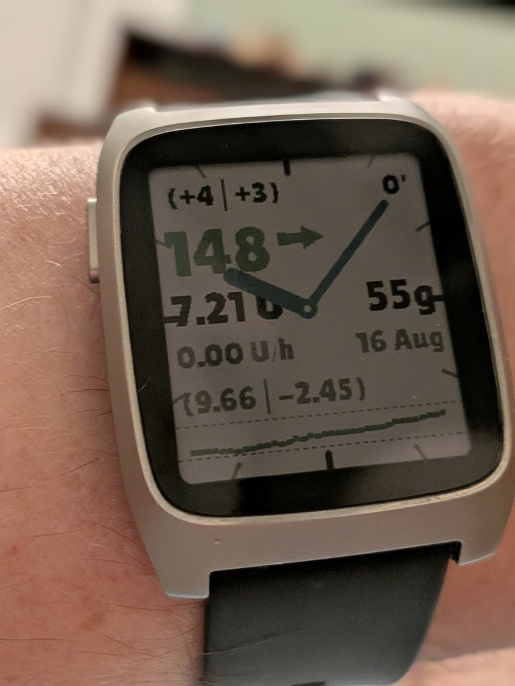

# Pebble AAPS Watchface (Pebble Time 2 v2)

<p align="center">
  
</p>

A lightweight, low-power, and robust Pebble C watchface designed for the **Pebble Time 2** (Emery platform, 200x228 color display) and compatible with other Pebble models via `pebble-scalable`. It connects to **AndroidAPS (AAPS)** to show real-time glucose status, active pump treatments, and a glucose history curve.

---

## ⚠️ Safety Notice & Disclaimer

> **IMPORTANT**: **PebbleAAPS** (and any associated watchface, watchapp, sync plugin, or communication code) is a passive, secondary visual monitoring display only. It does not calculate or deliver insulin, nor does it control your pump, CGM, or looping algorithms.
> 
> **Scope**: This safety notice applies to the AndroidAPS Pebble sync plugin, this PebbleAAPS watchface application, any alternative or derived watchfaces/watchapps, and all code, libraries, or protocols that communicate with or transfer data between AndroidAPS and Pebble devices.
> 
> **Hardware & Supplies**: The safety of AAPS relies on the safety features of your hardware (phone, pump, CGM). Only use a fully functioning FDA/CE-approved insulin pump and CGM. Do not use broken, modified, or self-built insulin pumps or CGM receivers. Only use original consumable supplies (inserters, cannulas, and insulin reservoirs) approved by the manufacturer for use with your pump and CGM. Using untested or modified supplies can cause inaccuracy and insulin dosing errors, resulting in significant risk to the user.
> 
> **User Responsibility & Assumption of Risk**: By installing, building, or using this watchface, the AndroidAPS Pebble sync plugin, or any code that communicates with them, you acknowledge and agree that:
> - You assume **full, sole responsibility** for your health, medical treatment decisions, and use of this software.
> - Watch displays, companion sync plugins, and Bluetooth communications are subject to disconnections, signal loss, stale data, battery exhaustion, or software/rendering delays. **Never make medical or insulin dosing decisions based solely on this watchface, sync plugin, or associated code.** Always verify current readings on your primary FDA/CE-approved medical hardware or blood glucose meter.
> - This software is provided **"AS IS"** under the GNU General Public License v3.0, without warranty of any kind, express or implied. The developers, contributors, and distributors assume no liability or responsibility for any injury, illness, dosing errors, or damages resulting from the use of or reliance upon this software, watchface, plugin, or associated communication code.

---

## Features

- **Responsive Scaling (`pebble-scalable`)**: Fully responsive layout designed using relative coordinates that auto-scale gracefully to Emery (200x228), classic (144x168), and circular (180x180) screens.
- **Stateful Persistence**: Automatically loads the last known state from Pebble persistent storage on boot and saves state updates on every AppMessage receipt, preventing data loss when switching apps.
- **Glanceable Dashboard Layout**:
  - **Top Row**: Blood Glucose Rate of Change (Delta) and data sync Age.
  - **Middle Row**: Large high-legibility Blood Glucose reading and a dynamic color-coded Trend Arrow.
  - **Status Columns**: Left column displays active insulin metrics (IOB, Detailed Split, Basal Rate); right column displays Carbs on Board (COB) and Date.
  - **Glucose History Graph**: 36-point history graph showing low (red) and high (yellow) dashed target thresholds (defaulting to 70/180 mg/dL if targets are not set). Supports automatic "shift-left" slide animation as data ages on sync disconnection.
- **Analog-Digital Hybrid Clock**: Features tick marks around the screen edge and sweeping hour/minute hands overlaid cleanly on top of the digital AAPS dashboard.
- **Host-Runnable TDD Architecture**: Business logic is completely decoupled from the Pebble SDK, enabling unit testing (`gcc`) on the host machine without requiring the emulator.
- **Minimal RAM Footprint**: Optimized to minimize heap fragmentation by using programmatic line drawings for ticks and target bounds instead of loading GBitmap resources.

---

## Screen Layout

```text
+-------------------------------------------------------------+
| [12:00 Tick]                                                |
| [Delta] (+3|+5)                                  [Age] (3') |
|                                                             |
|                   [Glucose]      [Trend]                    |
|                     6.2            →                        |
|                                                             |
| [9:00 Tick]           (Analog Hands)           [3:00 Tick]  |
|                                                             |
|     INSULIN COLUMN (LEFT)          CARBS & DATE (RIGHT)     |
|       [IOB]                          [COB]                  |
|       0.32 U                         0g                     |
|       [Basal Rate]                   [Date]                 |
|       0.90                           9 Aug                  |
|       [Detailed IOB]                                        |
|       (0.02|0.31)                                           |
|                                                             |
| ------------[High Target: 190px (Dashed Gray)]------------- |
| ....................[Glucose dots (4x4)].................... |
| ------------[Low Target:  212px (Dashed Red)]-------------- |
|                                                             |
|                      [6:00 Tick]                            |
+-------------------------------------------------------------+
```

---

## File Structure

```
├── package.json          # App metadata, UUID settings, keys mapping, pebble-scalable
├── wscript               # Pebble SDK build configuration rules
├── README.md             # This document
├── TASKS.md              # Roadmap and verification checklist
├── src/
│   └── c/
│       ├── logic.h       # Decoupled state struct & logic declarations
│       ├── logic.c       # Logic implementation (C-only, no Pebble SDK dependencies)
│       ├── state_store.h # Stateful persistence interface
│       ├── state_store.c # Stateful persistence implementation (Pebble SDK only)
│       └── pebble_watchface.c # Main Pebble UI, Tick, GPaths, drawing, and AppMessage shell
├── docs/
│   ├── design/
│   │   ├── PebbleAAPS.pfs
│   │   └── pebble_aaps_design_spec.md # Layout coordinates & design rationale
│   └── eng/
│       ├── plan.md       # Watchface engineering design & implementation plan
│       └── androidaps_pebble_protocol.md # Companion app integration design
├── tests/
│   └── test_logic.c      # Host unit test suite runner
└── resources/
    └── images/           # 48x48 color arrow PNG resource icons
```

---

## Local Build & Host-Based Testing

### 1. Run Unit Tests (TDD Cycle)
Compile and run the test harness on your host machine to verify core logic:
```bash
gcc -Wall -Wextra src/c/logic.c tests/test_logic.c -o test_runner && ./test_runner && rm test_runner
```

### 2. Build Watchapp Bundle
Compile and build the final Pebble `.pbw` application package:
```bash
pebble build
```
The compiled bundle will be output to `build/PebbleAAPS.pbw`.

---

## Emulator Testing (Headless/VNC)

If working over SSH or headless:

1. **Start virtual display**:
   ```bash
   Xvfb :99 -screen 0 800x600x24 &
   ```
2. **Install and run the Emery emulator with VNC enabled**:
   ```bash
   pebble install --emulator emery --vnc
   ```
3. **Capture screenshot to verify UI**:
   ```bash
   pebble screenshot tmp/screenshots/test.png
   ```
4. **Send mock data updates**:
   - *Full status update (BG=120, Trend=Flat, IOB=0.32U, COB=0g, Basal=0.90, Details=(0.02|0.31), Delta=+3, AvgDelta=+5)*:
     ```bash
     pebble send-app-message --int 0=120 1=5 4=$(date +%s) --string 2="0.32 U" 3="0g" 5="0.90" 6="(0.02|0.31)" 7="+3" 8="+5"
     ```
   - *Stale data update (last updated 20 minutes ago)*:
     ```bash
     pebble send-app-message --int 0=130 1=3 4=$(( $(date +%s) - 1200 )) --string 2="0.0 U" 3="0g" 5="0.90" 6="(0|0)" 7="-2" 8="-1"
     ```
   - *Out-of-bounds boundary fallback*:
     ```bash
     pebble send-app-message --int 0=95 1=15 4=$(date +%s)
     ```
   - *History Graph Injection (36-byte array, each byte = BG/2)*:
     ```bash
     # Send history array using hex string representation:
     pebble send-app-message --bytes 9=3c3c3c3c3d3d3e3e3f3f40404141424243434444454546464747484849494a4a4b4b4c4c
     ```

---

## Hardware Sideloading & Integration

1. Copy the compiled bundle `build/PebbleAAPS.pbw` to your Android phone.
2. Tap the file in your phone's File Manager and select **Gadgetbridge** (or the official **Pebble app**) to install it on your watch.
3. In **AndroidAPS**, open the **Config Builder**, check the box next to **Pebble** in the *Sync plugins* section, and confirm settings match. AAPS will now automatically sync readings directly to your watchface.

---

## 📚 Documentation & Contributing

- **Documentation Index**: See [`docs/README.md`](docs/README.md) for complete technical specifications, architecture diagrams, and protocol definitions.
- **Architecture Overview**: [`docs/eng/architecture.md`](docs/eng/architecture.md)
- **AAPS Protocol Specification**: [`docs/eng/androidaps_pebble_protocol.md`](docs/eng/androidaps_pebble_protocol.md)
- **Design Blueprint**: [`docs/design/pebble_aaps_design_spec.md`](docs/design/pebble_aaps_design_spec.md)
- **Contributor Guide**: Check out [`CONTRIBUTING.md`](CONTRIBUTING.md) for local environment setup, host testing, and PR submission guidelines.

---

## ⚖️ License

Distributed under the **GNU General Public License v3.0 (GPL-3.0)**. See [`LICENSE`](LICENSE) for complete details.

